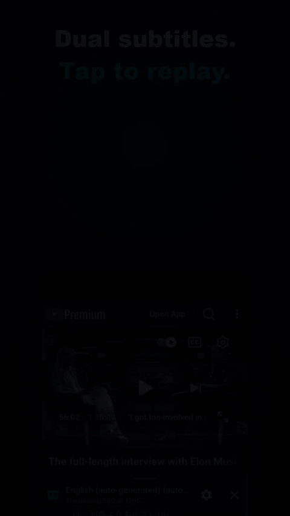
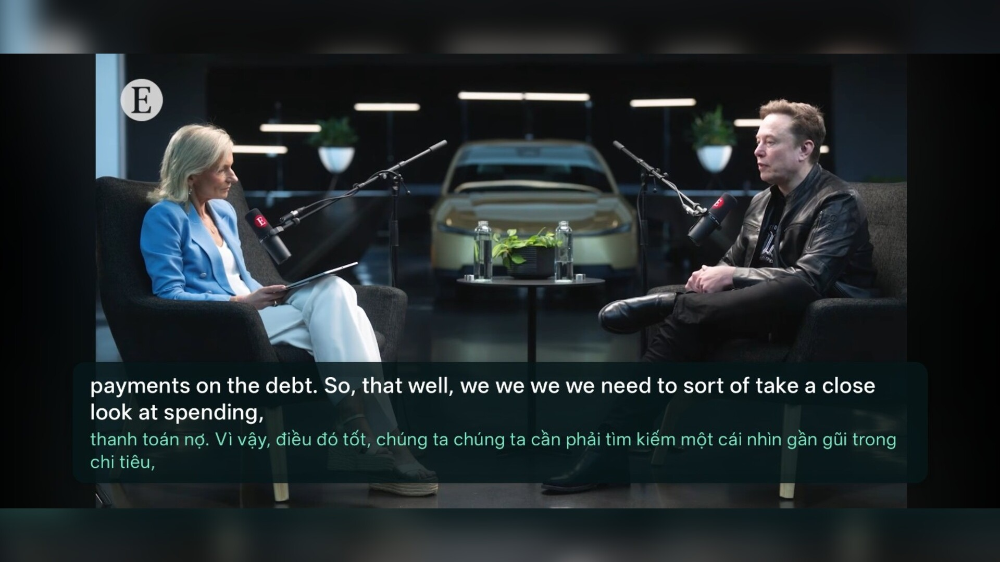
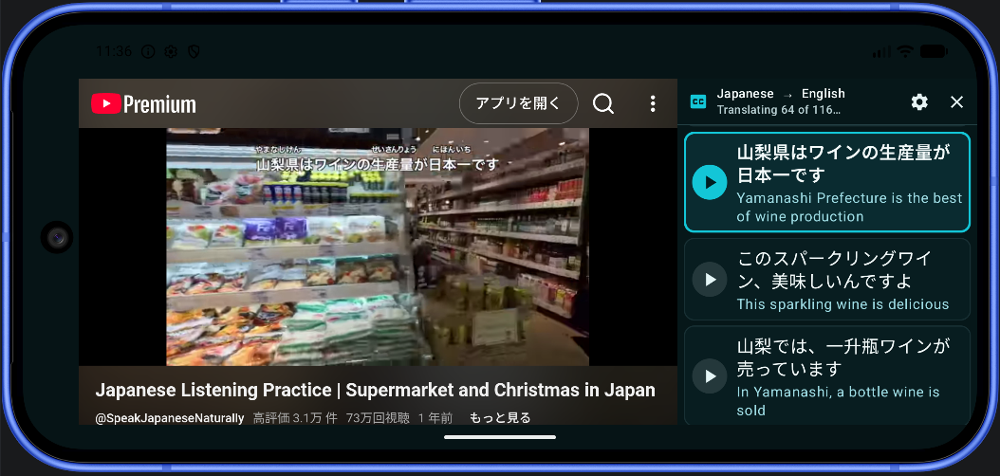
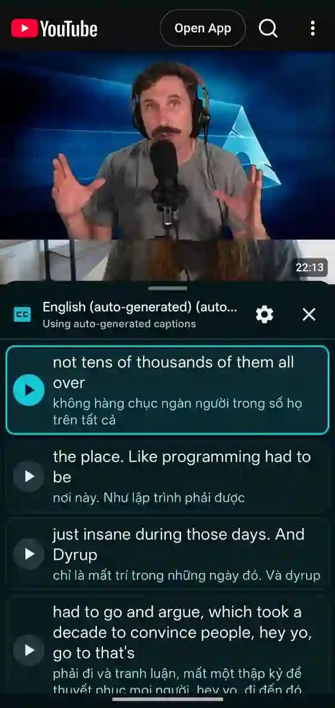

# DualSub Replay

Watch YouTube with two subtitle languages at once, then tap any sentence to replay that exact moment. Translation runs on your Android device.

[](https://github.com/hoangkien1703/dual-sub-replay/releases/latest)
[](https://github.com/hoangkien1703/dual-sub-replay/releases/latest/download/DualSub-Replay.apk)
[](https://github.com/hoangkien1703/dual-sub-replay/actions/workflows/android.yml)
[](LICENSE)
[](THIRD_PARTY_NOTICES.md)

<p align="center">
  <a href="docs/media/dualsub-replay-promo.mp4">
    
  </a>
</p>

<p align="center">
  <a href="https://github.com/hoangkien1703/dual-sub-replay/releases/latest/download/DualSub-Replay.apk"><strong>Download the latest official APK</strong></a>
  ·
  <a href="docs/media/dualsub-replay-promo.mp4">Watch the 30-second demo</a>
</p>

## Why DualSub Replay?

- **See every meaning:** keep original and translated captions together while you watch.
- **Repeat without scrubbing:** tap a subtitle paragraph to jump back and hear it again.
- **Learn privately:** translate on-device with Google ML Kit; no API key is required.

If DualSub Replay helps your learning, consider [starring the repository](https://github.com/hoangkien1703/dual-sub-replay). It helps other language learners discover the project.

## Download

### [Download DualSub Replay for Android](https://github.com/hoangkien1703/dual-sub-replay/releases/latest/download/DualSub-Replay.apk)

Requires **Android 8.0 or newer**. No account or API key is required.

### Installation

1. Tap the download link above and open `DualSub-Replay.apk` when it finishes.
2. If Android asks, allow your browser or file manager to **install unknown apps**.
3. Tap **Install**, then open DualSub Replay.

Android may show a standard warning because the app is downloaded directly from GitHub instead of Google Play.

> **Installing after testing a preview?** Current preview builds install separately as **DualSub Replay Preview**, so you can keep both apps. Official releases update the existing official app. Preview settings and vocabulary remain in the preview app; use Practice backup and transfer to move saved study data.

Want to test the newest development build? See the [preview release](https://github.com/hoangkien1703/dual-sub-replay/releases/tag/preview). Preview builds may be less stable and use a different signature.

## App preview

<p align="center">
  
</p>

<p align="center">
  
</p>

<p align="center">
  
</p>

## Features

- Browse and search the real mobile YouTube site inside the app.
- Open watch, Shorts, live, embed, and `youtu.be` links in the same persistent YouTube WebView.
- Play videos with YouTube's native mobile webpage player and controls.
- Retrieve manual or auto-generated public captions automatically.
- Parse YouTube's default timed-text XML, nested SRV3 XML, and JSON3 caption formats.
- Choose from the caption languages offered by each video and translate into any language supported by Google ML Kit.
- Download translation models on demand and remember the preferred target language.
- Merge short caption cues into readable paragraphs.
- Place the dual-subtitle timeline in a temporary bottom layer over the single YouTube page.
- Rotate to landscape for a default-on 75/25 split favoring the video; drag the divider to resize the video between 65% and 85% of the width, and the app remembers your choice.
- Landscape mode uses immersive edge-to-edge layout: status/navigation bars hide automatically and content can use display-cutout/camera space, while system bars remain available with a swipe.
- Highlight the current paragraph and tap any paragraph to replay it.
- Follow the currently spoken word on eligible YouTube auto-generated captions with Adaptive timing by default, or choose strict Live YouTube or Transcript timing in subtitle settings.
- Swipe the panel header down in portrait or right in landscape, or use its close button, to reveal the complete YouTube page, including the same video,
  actions, comments, and recommendations; no second player or webpage is created.
- Reopen the subtitle timeline and remember the subtitle text size.
- Build, test, and publish installable APKs automatically with GitHub Actions.

## User flow

1. Open DualSub Replay; the YouTube Browse screen appears immediately.
2. Search normally and choose a captioned video.
3. The selected watch page stays in the same WebView while captions and translations load.
4. The dual-subtitle timeline tracks the native webpage video's playback time, below it in portrait or beside it in landscape.
5. Tap any subtitle paragraph to seek to its start and resume playback.
6. Swipe the subtitle timeline down in portrait or right in landscape to like the video, read comments, or choose another video.
7. Press Back to navigate through normal YouTube browsing history.

Sharing a YouTube watch, Short, live, embed, or `youtu.be` URL to DualSub Replay navigates the same WebView directly to it.

Starting with v0.3.3, the app experimentally keeps the Google/YouTube sign-in flow inside the same WebView, persists its WebView cookies, and automatically returns to the previous YouTube page after two-step verification completes. Google officially does not support account authentication in embedded WebViews, so Google may still reject the login with a “browser or app may not be secure” message. No user-agent spoofing or cookie copying is used.

## Important limitations

YouTube's official Data API does not allow ordinary viewers to download captions from arbitrary public videos. To provide automatic captions, this prototype uses YouTube's undocumented Innertube transcript endpoint. It can stop working when YouTube changes its internal API, and its use may be restricted by YouTube's terms. The extraction code is isolated in `YouTubeCaptionProvider` so it can be replaced without rewriting the app.

Online video playback uses the native player in YouTube's mobile webpage. Saved vocabulary can optionally use online examples for practice through the single YouTube WebView. Normal browsing does not download media. The subtitle layer can be hidden at any time to restore the unobstructed YouTube page.

## Saved words and practice

Tap a word in either subtitle line to hear it, inspect its meaning, and choose **Save word**. Pronunciation uses the tapped word's language, trying your preferred Android speech engine and then other installed engines. It prefers installed offline voices and can fall back to a supported network voice. If no voice works, use **Speech settings** to install or select one, then tap **Pronounce** again. Automatic pronunciation can be disabled in Settings, and the Pronounce button remains available.

Each card stores an editable meaning and its original subtitle context. The Online example option replays the saved sentence in the existing YouTube page and stops at its end. A translated word's example contains the original spoken sentence, which may not literally contain the translated word.

Open **Saved words** beside Settings to search, edit, delete, or practice cards. Practice reveals the meaning on request and schedules reviews with Again (10 minutes), Hard (initially 1 day), Good (3 days), or Easy (7 days). Later successful reviews expand the previous interval by 1.2, 2, or 3 respectively; Again restarts progression. This is an independent local review system, without Anki sync. Cards are due immediately when first saved; duplicate saves of the same word/languages/video/segment retain review progress.

Offline video downloading and local video playback have been removed to reduce APK size and simplify the app. Existing clip files from previous versions are preserved in app-private storage without being automatically deleted. Deleting a word removes its review history. Resetting Settings preserves vocabulary.

## Distribution licenses

Source contributed to this repository is released under the [MIT license](LICENSE). See [third-party notices and build/source information](THIRD_PARTY_NOTICES.md).

Live spoken-word timing reads caption text rendered by YouTube's webpage and is available only for eligible auto-generated caption tracks. Highlighting automatically falls back to transcript timing when a reliable live word cannot be mapped; manual captions always use transcript timing. YouTube's page structure and WebView behavior can vary by video and device, so live word timing may be unavailable or less precise on some phones.

Official APKs use a dedicated production signing key kept outside the repository and restored through encrypted GitHub Actions secrets. Preview APKs use a separate CI debug signature, so Android treats the preview and official release as different update lines.

## Development

Requirements:

- Android Studio compatible with Android Gradle Plugin 9.3
- JDK 17
- Android SDK 36
- An API 36 AOSP x86_64 system image for managed-device tests

The Gradle 9.5 wrapper is committed, so a separate Gradle installation is not required.

On Windows PowerShell:

```powershell
.\gradlew.bat testDebugUnitTest lintDebug assembleDebug assembleDebugAndroidTest
.\gradlew.bat pixel2Api36DebugAndroidTest
```

On Linux or macOS:

```bash
bash ./gradlew testDebugUnitTest lintDebug assembleDebug assembleDebugAndroidTest
bash ./gradlew pixel2Api36DebugAndroidTest
```

The managed-device suite uses a Pixel 2 profile with an API 36 AOSP image. Its WebView fixtures are designed to run without calls to the live YouTube site. On headless CI hosts, also pass `-Pandroid.testoptions.manageddevices.emulator.gpu=swiftshader_indirect`.

Debug APKs are produced at `app/build/outputs/apk/debug/app-debug.apk`. An official release build requires the four `ANDROID_RELEASE_*` signing environment variables and `-PrequireReleaseSigning=true`; signing credentials must never be committed.

## Architecture

- `YouTubeUrlParser` normalizes shared links and extracts video IDs.
- `YouTubeCaptionProvider` discovers and downloads timed caption cues.
- `SubtitleMerger` converts small cues into replayable paragraphs.
- `OnDeviceTranslator` uses Google ML Kit to translate between the selected supported languages.
- `AppViewModel` tracks the active watch URL, caption loading, translation, and active cue.
- `SingleYouTubePage` owns the app's only WebView and keeps normal YouTube navigation and playback intact.
- A small JavaScript polling bridge reads the native page video's time and seeks that same video for replay.
- `DualSubApp` places the hideable dual-subtitle timeline below the single YouTube surface in portrait or beside it in landscape.

## Continuous integration

Pull requests use the committed wrapper to run formatting and complexity checks, unit tests, lint, debug and Android-test APK assembly, and an optimized release build. A second job executes the offline fixture suite on the API 36 managed device. Both jobs must pass before merging into `main`. Same-repository pull requests also publish a numbered test APK such as `DualSub-Replay-PR63-build271-preview.apk` to the rolling preview release and remove it automatically when the PR is closed. After merge, the main publishing workflow builds the rolling preview without repeating PR tests. When `main` contains a new app version without a matching version tag, it also builds, verifies, and publishes the production-signed APK as the latest official release.

## Privacy

No account or API key is required. YouTube receives normal player and transcript requests. ML Kit downloads only the language models needed for selected translations, then performs translation on the device. The app stores the last Browse URL, target language, text-size setting, and landscape split ratio in local app preferences.

See [PRIVACY.md](PRIVACY.md) for the full privacy overview.

## Contributing and roadmap

Contributions are welcome. Read [CONTRIBUTING.md](CONTRIBUTING.md), the [Code of Conduct](CODE_OF_CONDUCT.md), and the compact [roadmap](ROADMAP.md) before opening a pull request.

## License

MIT. This project is independently implemented and is not affiliated with 1Letters, YouTube, or Google.
