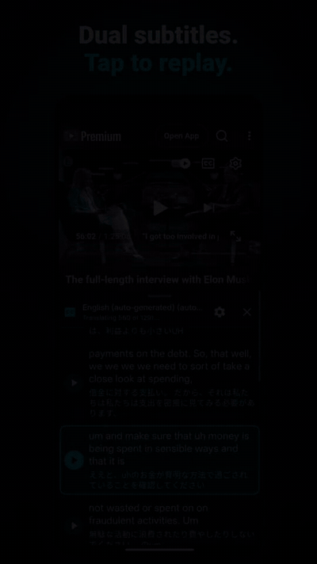
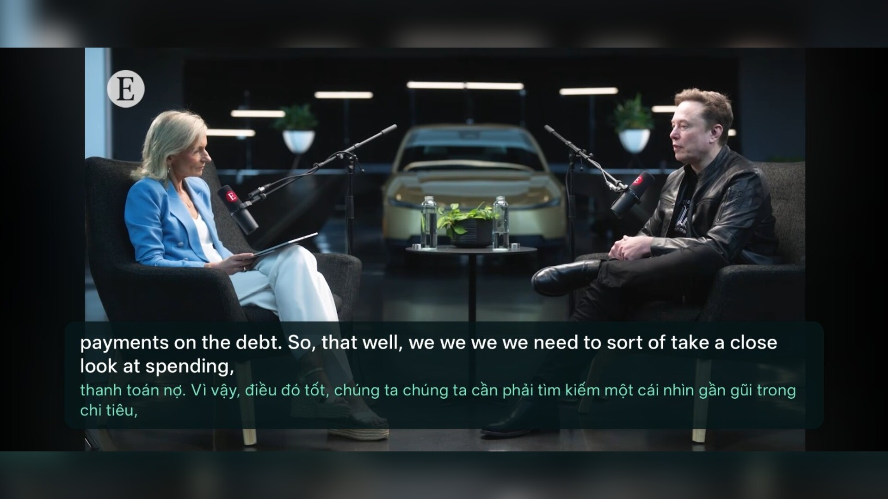
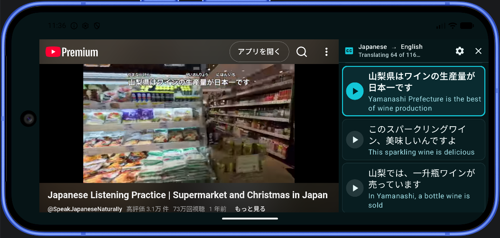
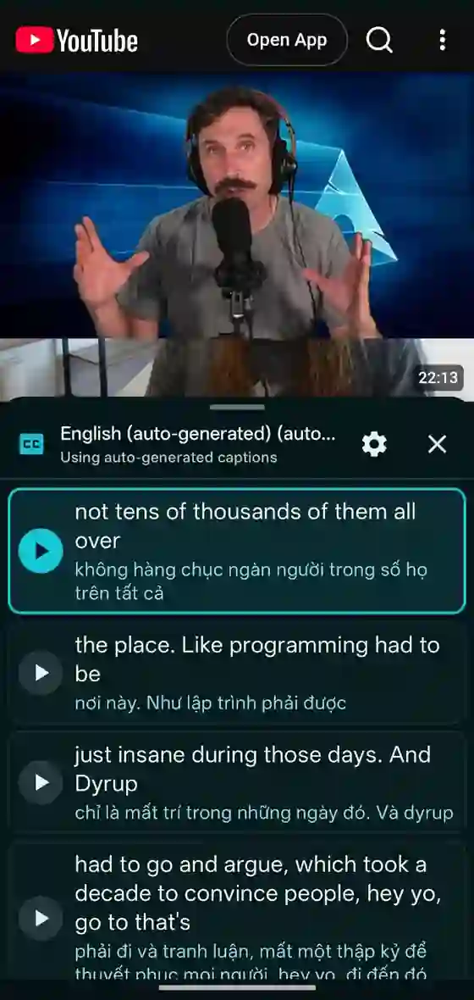

# DualSub Replay

**Learn a language with YouTube.** Watch videos with subtitles in two languages, tap a sentence to hear it again, and tap a word to see what it means. Free for Android phones.

[](https://github.com/hoangkien1703/dual-sub-replay/releases/latest)
[](https://github.com/hoangkien1703/dual-sub-replay/releases/latest/download/DualSub-Replay.apk)
[](https://github.com/hoangkien1703/dual-sub-replay/actions/workflows/android.yml)
[](LICENSE)
[](THIRD_PARTY_NOTICES.md)

<p align="center">
  <a href="https://github.com/hoangkien1703/dual-sub-replay/releases/latest/download/DualSub-Replay.apk"></a>
</p>

<p align="center">
  Android 8.0 or newer · No account · No ads<br>
  Want the newest features first? <a href="https://github.com/hoangkien1703/dual-sub-replay/releases/tag/preview">Try the preview version</a> (may be less stable).
</p>

### How to install

1. Tap the green **Download for Android** button above on your phone.
2. When the download finishes, open the file `DualSub-Replay.apk`.
3. If your phone asks, allow your browser or file manager to **install unknown apps**, then tap **Install**.

Android may show a warning because the app comes from GitHub instead of Google Play. This is normal for apps installed this way. Official versions update the installed app in place.

> **About the preview version:** it installs as a separate app called **DualSub Replay Preview**, so you can keep both. Your saved words do not move between them automatically; use **Saved words → Export** and **Import** to copy them.

## See it in action

<p align="center">
  <a href="docs/media/dualsub-replay-promo.mp4">
    
  </a>
</p>

<p align="center"><a href="docs/media/dualsub-replay-promo.mp4"><strong>▶ Watch the full video (50 seconds)</strong></a></p>

<p align="center">
  
</p>

<p align="center">
  
</p>

<p align="center">
  
</p>

### [Download DualSub Replay for Android](https://github.com/hoangkien1703/dual-sub-replay/releases/latest/download/DualSub-Replay.apk)

Free · Android 8.0 or newer · See [How to install](#how-to-install) if you need help.

## Why DualSub Replay?

DualSub Replay is a free, open-source **dual subtitles app for YouTube on Android**. It shows bilingual captions (the original and a translation into any of 59 languages), replays a sentence with one tap, explains words and Japanese grammar, and saves words for spaced-repetition practice. [Website](https://hoangkien1703.github.io/dual-sub-replay/) · [Tiếng Việt](https://hoangkien1703.github.io/dual-sub-replay/vi/)

- **See every meaning.** The original caption and its translation stay together while you watch.
- **Repeat without scrubbing.** Tap a subtitle line and the video jumps back to that exact moment.
- **Learn the words you hear.** Tap a word for its meaning, part of speech, pronunciation and, for Japanese, the grammar around it.
- **Remember them.** Save words with their original sentence and review them with spaced repetition.
- **Stay private.** Translation happens on your phone. There is no account, no tracking, and no ads.

If DualSub Replay helps your learning, consider [starring the repository](https://github.com/hoangkien1703/dual-sub-replay). It helps other language learners discover the project.

## Features

### Watch with dual subtitles

- Browse and search the real mobile YouTube site inside the app, or share a YouTube link (watch, Shorts, live, embed, or `youtu.be`) to DualSub Replay.
- Captions load automatically, manual or auto-generated, in any language the video offers.
- Translations go into any of the 59 languages Google ML Kit supports. Download language models ahead of time in **Settings → Translation → Languages on this device** to translate offline.
- Short caption fragments are merged into readable sentences, and the current one is highlighted. On eligible auto-generated captions, the spoken word is highlighted too.

### Replay any sentence

- Tap a subtitle line to jump back to its start and hear it again.
- Swipe the subtitle panel away to see the whole YouTube page (likes, comments, recommendations) and bring it back anytime.
- Rotate to landscape for an edge-to-edge split view: the video on the left and subtitles on the right. Drag the divider to resize it; the app remembers your choice.

### Look up words and grammar

- Tap a word in either subtitle line; tap another word in the same line to select the whole phrase. A small bar shows the translation right away, with **Copy**, **Translate** and **Pronounce**.
- **Translate** opens a card with the meaning, each word's part of speech, and **Save to vocabulary**.
- For Japanese, the card also explains the grammar of the selection and the particle right after it (for example に or 〜てくれました).
- **Pronounce** uses the voices installed on your phone, preferring offline voices.

### Practice saved words

- Open **Saved words** to search, edit, or practice your cards. Each card keeps its original sentence and can replay it in the video.
- Reviews use spaced repetition: **Again** (10 minutes), **Hard** (1 day), **Good** (3 days), or **Easy** (7 days), with intervals growing on later reviews.
- Export a full backup or Anki text, and import it on another phone. See [Practice transfer](docs/practice-transfer.md).

### Track your progress

- **Progress** in the menu shows today's watch time against a daily goal, your streak, totals for the week, month, year and all time, and the time spent in each language.
- Time counts only while a captioned video plays, and it is stored only on your device.

### Use the app in your language

The interface is available in English, Tiếng Việt, Español, Português (Brasil), 日本語, 한국어, 简体中文 and Bahasa Indonesia. It follows your phone's language; the globe button at the bottom of the menu picks another.

## Quick start

1. Open DualSub Replay, choose your native language and the language you are learning, and skim the short guide.
2. Search YouTube and pick a video with captions.
3. Read the original and translated subtitles below the video, or beside it in landscape.
4. Tap a subtitle line to replay it, or tap a word to learn it.
5. Press Back to keep browsing YouTube as usual.

## FAQ

**How do I watch YouTube with two subtitles at once on Android?** Install DualSub Replay, open a captioned video, and pick your language. The original caption and its translation appear together under the video, or beside it in landscape.

**Which languages can I learn?** The original can be any caption language a video offers, including auto-generated captions. Translations go into the 59 languages supported by Google ML Kit, such as English, Spanish, Japanese, Korean, Chinese, French, German, and Vietnamese. **Settings → Translation → Languages on this device** lists them, shows which are downloaded, and lets you download or remove each one so translation works offline.

**Is there a Language Reactor-style tool for Android?** Browser extensions such as Language Reactor run in desktop Chrome, not in the Android YouTube app. DualSub Replay is a separate, unaffiliated Android app with a similar two-language view, plus tap-to-replay, word lookup, and saved-word practice.

**Can I sign in to YouTube?** Experimentally. The Google sign-in flow stays inside the app and returns to your video afterwards, but Google does not officially support signing in from embedded WebViews and may reject it with a "browser or app may not be secure" message. The app never spoofs its user agent or copies cookies.

**Is it on Google Play or F-Droid?** Not yet. Install the official APK from [GitHub releases](https://github.com/hoangkien1703/dual-sub-replay/releases/latest). A fully open-source build for F-Droid, which translates with Mozilla's Bergamot engine instead of ML Kit, is being prepared; see [F-Droid distribution](docs/fdroid/README.md).

## Privacy

No account or API key is required, and the app has no analytics or advertising SDKs. YouTube receives the same page, player and caption requests as a normal visit. ML Kit downloads only the language models you use, then translates on the device. If you turn on Settings → Translation → Google Translate (online), subtitle text is sent to Google instead; it is off by default. Settings, saved words, and progress stay in local app storage. See [PRIVACY.md](PRIVACY.md) for details.

## Limitations

- YouTube's official Data API does not let ordinary viewers download captions from arbitrary public videos, so DualSub Replay reads them through YouTube's undocumented internal interfaces. They can change without notice, and their use may be restricted by YouTube's terms. That code is isolated in `YouTubeCaptionProvider` so it can be replaced.
- Videos play in YouTube's own mobile webpage player; the app does not download video. Spoken-word highlighting depends on YouTube's page and may be unavailable or less precise on some videos and phones, in which case it falls back to sentence timing.

## For developers

### Build

Requirements: Android Studio compatible with Android Gradle Plugin 9.3, JDK 17, Android SDK 36, and an API 36 AOSP x86_64 system image for managed-device tests. The Gradle 9.5 wrapper is committed, so a separate Gradle installation is not required.

```bash
bash ./gradlew testDebugUnitTest lintDebug assembleDebug assembleDebugAndroidTest
bash ./gradlew pixel2Api36DebugAndroidTest
```

On Windows, use `.\gradlew.bat` instead. The managed-device suite runs on a Pixel 2 profile with offline WebView fixtures, so it never calls the live YouTube site; on headless hosts also pass `-Pandroid.testoptions.manageddevices.emulator.gpu=swiftshader_indirect`.

The debug APK is written to `app/build/outputs/apk/debug/app-debug.apk`. Add `-Pdistribution=fdroid` to build the F-Droid variant; it needs the git submodules, NDK r28c and CMake 3.22.1 ([F-Droid distribution](docs/fdroid/README.md)). Release builds need the four `ANDROID_RELEASE_*` signing variables and `-PrequireReleaseSigning=true`; never commit signing material.

### Architecture

- `SingleYouTubePage` owns the app's only WebView and keeps normal YouTube navigation and playback intact. A small JavaScript polling bridge reads the page video's time and seeks that same video for replay.
- `YouTubeUrlParser` normalizes shared links; `YouTubeCaptionProvider` discovers and downloads timed captions; `SubtitleMerger` turns short cues into replayable sentences.
- `OnDeviceTranslator` translates with Google ML Kit (Bergamot in the F-Droid build).
- `AppViewModel` tracks the active video, caption loading, translation, and the current line; `DualSubApp` places the subtitle panel below the video in portrait or beside it in landscape.

See the [technical context](docs/project/tech-stack.md) for the invariants that tests enforce.

### CI, releases, and the website

Pull requests run formatting, complexity, unit, lint, build, and managed-device checks, and publish a numbered test APK to the rolling preview release. Merges by the owner publish an official release automatically. See [Continuous integration and releases](docs/releasing.md) for versioning, release labels, and recovery.

The landing page in `site/` (English and Vietnamese) deploys to GitHub Pages when `site/` or `docs/images/` changes on `main`. The demo video, README GIF, poster and social card are rendered from code in [tools/promo-video](tools/promo-video/README.md).

## Contributing and roadmap

Contributions are welcome. Read [CONTRIBUTING.md](CONTRIBUTING.md), the [Code of Conduct](CODE_OF_CONDUCT.md), and the compact [roadmap](ROADMAP.md) before opening a pull request. Humans and coding agents share the [project context](docs/project/mission.md), [technical context](docs/project/tech-stack.md), and [lightweight spec workflow](docs/specs/README.md); [AGENTS.md](AGENTS.md) gives operational instructions.

## License

Source contributed to this repository is released under the [MIT license](LICENSE). See [third-party notices and build/source information](THIRD_PARTY_NOTICES.md). This project is independently implemented and is not affiliated with 1Letters, YouTube, or Google.
